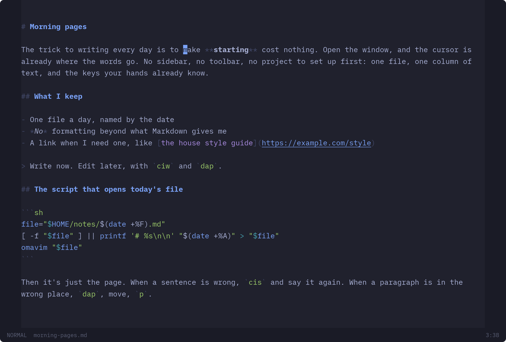
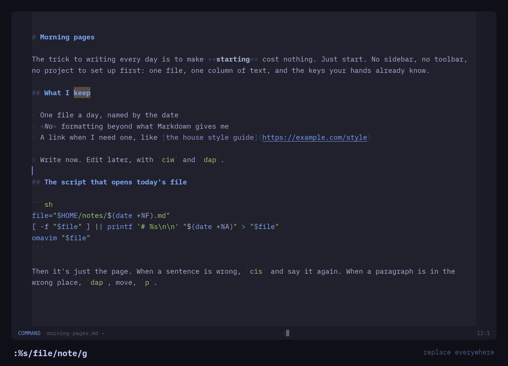

# Omavim

**A dead-simple writing app with Vim motions.** One window, one column of
text, and nothing else on screen. Underneath it is real Vim: text objects,
registers, macros, marks, `:s` and `:g`, each checked key for key against
Neovim. For Markdown first, and code too.



Written in Rust with [iced](https://iced.rs) and tree-sitter, in the spirit of
[Omawrite](https://github.com/omacom/omawrite). There's a tour with more
pictures at **[codemonkey76.github.io/omavim](https://codemonkey76.github.io/omavim/)**.



## Install

The latest release, into `~/.local` (Linux, x86_64, no Rust needed):

```sh
curl -fsSL https://github.com/codemonkey76/omavim/releases/latest/download/omavim-x86_64-linux.tar.gz | tar -xz -C ~/.local --strip-components=1
```

That puts `omavim` in `~/.local/bin` and adds it to your app launcher. Then:

```sh
omavim notes.md     # or no file, for a new one; several files open a window each
```

It needs `xdg-desktop-portal` and a backend such as `xdg-desktop-portal-gtk`
(for the file pickers, printing, and following dark/light and the text size),
which Omarchy and most desktops already have.

From source on Arch or Omarchy: `cd pkgbuild && makepkg -si`.

To remove it:

```sh
rm ~/.local/bin/omavim ~/.local/share/applications/omavim.desktop ~/.local/share/icons/hicolor/scalable/apps/omavim.svg
```

## What you get

- **Vim as the editor, not an add-on.** Modes, counts, operators, text
  objects, registers, macros, marks, the jump list, search and the command
  line. See [Vim](#vim) for all of it.
- **Checked against Neovim.** More than 44,000 generated cases are typed key
  by key into headless Neovim, and Omavim's engine must end each one with the
  same text, cursor, mode, registers, view, marks and jump list.
- **Made for prose.** Lines wrap at word breaks, `j` and `k` move by the line
  you see, `gq` reflows a paragraph, and Markdown has text objects of its own
  (`ih` is a heading's whole section).
- **Code too.** Tree-sitter highlighting for 16 languages, code blocks in
  Markdown in their own language, and text objects for functions, classes,
  parameters and comments.
- **Follows your desktop.** The current Omarchy theme's colours, live; dark or
  light elsewhere; the desktop's text size. iA Writer Mono is built in.
- **Looks after your words.** Drafts are written as you type and offered back
  after a crash. A file changed by something else is loaded again, or asked
  about if you have changes of your own.
- **The rest of a writing app.** Open and save through the desktop's file
  picker, printing at 12pt on the paper you pick, fullscreen, and a key
  reference on `Space ?`.

It is one file in one window, on purpose. See [What it isn't](#what-it-isnt).

## Omavim's keys

Vim's keys mean what they mean in Vim. Omavim's own sit behind a leader,
`Space`, in normal mode:

| Keys | Does | Also |
| --- | --- | --- |
| `Space w` | save (asks where, the first time) | `:w`, and `Ctrl+S` in every mode |
| `Space W` | save as | `:saveas` |
| `Space o` | open (pick several: each opens in a window of its own) | `:e`, `:new file` |
| `Space n` | new window | `:new` |
| `Space p` | print | `:hardcopy` |
| `Space f` | fullscreen, or back | `:fullscreen` |
| `Space b` / `Space i` / `Space l` | bold / italic / link: the word, or the selection in visual mode | |
| `Space ?` | the key reference | `:help` |
| `Space q` | close (asks, if there are unsaved changes) | `:q` |

## Settings

The leader, its keys and the text column's width can be changed in
`~/.config/omavim/config.toml`. Anything left out keeps its default.

```toml
leader = "space"   # or one character, such as ","
column = 120       # the text column's width in characters (0: the window's)

[keys]             # save, save_as, open, new_window, print, fullscreen,
save = "w"         # bold, italic, link, help, close
bold = "b"
```

On the command line, `omavim --version` and `omavim --help` do what they say,
and `--` ends the options (for a file whose name starts with a `-`).

## Vim

| | |
| --- | --- |
| **Modes** | normal, insert, replace, visual (`v`, `V` and `CTRL-V` blocks), command line |
| **Counts** | on everything that takes one: `3w`, `2dd`, `5.`, `d3w` |
| **Motions** | `h j k l` `0 ^ $ g_` <code>&#124;</code> `gg G` `w b e ge` `W B E gE` `f F t T ; ,` `{ }` `( )` `%` `H M L` `N%` |
| **By screen line** | `gj gk g0 g^ gm g$`, and `j`/`k` without a count |
| **Operators** | `d c y` `> <` `gu gU g~` and their doubled forms, `gq gw`, `D C Y` `x X` `s S` `r` `J gJ` `~` `p P` |
| **Text objects** | `iw aw` `iW aW` `is as` `ip ap`, brackets `i( i{ i[ i<`, quotes ``i" i' i` ``, tags `it at`, all with their `a` forms and in visual mode |
| **Visual mode** | `y d c I A r ~ u U > < p`, `o O`, `$` in blocks, `gv` |
| **Registers** | `"a`–`"z` (`"A` appends), `"0`, `"1`–`"9`, `"-`, `"_`, the read-only `". ": "%`, `"+` and `"*` for the desktop clipboard and primary selection, `Ctrl-R` in insert mode |
| **Search** | `/ ? n N * # g* g#`, offsets such as `/foo/e+1`, Vim's pattern syntax, matches highlighted as you type and after, `:noh` |
| **Marks and jumps** | `m{a-z}` `m{A-Z}`, `'` and `` ` ``, `'' '. '^ '[ '] '< '>`, kept on their text as it's edited; `CTRL-O`, `CTRL-I` |
| **Macros and repeat** | `q{reg}` (`q{A-Z}` appends), `@{reg}`, `@@`, `Q`, with counts; `.` |
| **Numbers** | `CTRL-A` / `CTRL-X` on decimal, `0x` hex and `0b` binary; in visual mode too, and `g CTRL-A` for a sequence |
| **Scrolling** | `CTRL-E CTRL-Y CTRL-D CTRL-U CTRL-F CTRL-B`, PageUp/PageDown, the wheel, `zt zz zb z<CR> z. z-` |
| **Undo** | `u`, `CTRL-R`; one insert is one step, as in Vim |

The command line:

| | |
| --- | --- |
| **Ranges** | `N . $ % /pat/ ?pat? 'x '<,'>` with `+`/`-` offsets, `;`, `3:` and visual `:` |
| **Substitute** | `:s` and `:%s` with Vim's replacement syntax and flags (`c` asks about each match), `:&`, `:&&`, `&`, `g&` |
| **Lines** | `:d :y :j :> :< :m :t :p`, `:normal`, and `:g` / `:v` with any of them |
| **Files** | `:e`, `:w`, `:q`, `:wq`, `:x`, `:saveas`, `:new` |
| **Settings** | `:set` with `ic scs ws hls ts sw ft` |
| **Editing it** | the cursor keys, `CTRL-W`, `CTRL-R`, `CTRL-V`, history on Up/Down for commands and searches, <code>&#124;</code> between commands, `@:` |

Lines wrap and the view scrolls exactly as Neovim's does with `'linebreak'`
and `'smoothscroll'`. `gq` and `gw` format paragraphs to the window's width
(at most 79), keeping comment leaders (`//`, `#`, `>`, ` * `) on each line.

### From the syntax tree

Highlighting for Markdown, Rust, Python, JavaScript, TypeScript, JSON, TOML,
YAML, Bash, HTML, CSS, PHP, Go, C, Lua and SQL, by the file's name (or
`:set ft=`). The tree is parsed again off the keystroke, so typing stays quick
in long documents. It also gives:

| | |
| --- | --- |
| **Markdown objects** | `i* a*` emphasis, `il al` a link, `ih ah` a heading's section, `ic ac` code |
| **Code objects** | `if af` a function, `ik ak` a class, `ia aa` a parameter, `i/ a/` a comment (in a Markdown code block as well) |
| **Moving** | `]f [f` `]k [k` `]h [h` to the next or last function, class or heading |
| **Brackets** | `%` skips brackets in strings and comments |
| **Indenting** | in after an open bracket or Python's `:`, back out for a close |

## What it isn't

Omavim is a focused editor for one file at a time, not an IDE. Left out on
purpose: language servers, a file tree, splits and tabs, project-wide search,
plugins, Vimscript and `.vimrc`, folds, spell checking, and `:!` filters.
[PLAN.md](PLAN.md) says where the line is and why.

## How the Vim is tested

`tools/fixtures/update` types every generated case, key by key, into headless
Neovim in a small window and records what it did. `cargo test` then runs the
same keys through Omavim's engine (`crates/omavim-vim`, which has no GUI) and
compares the text, cursor, mode, registers, view, marks and jump list.

```sh
cargo test                 # the engine against the recorded fixtures
tools/fixtures/update      # record them again (needs nvim)
```

## Building

```sh
cargo run -p omavim -- notes.md
```

| Crate | |
| --- | --- |
| `crates/omavim-vim` | the Vim engine: keys in, edits and cursor moves out |
| `crates/omavim-syntax` | tree-sitter: languages, highlighting, text objects, indenting |
| `crates/omavim` | the app: the window, the editor widget, files, portals, printing |

To release: bump `version` in Cargo.toml, commit, then
`git tag vX.Y.Z && git push origin vX.Y.Z`.

## Licence

Omavim is MIT. iA Writer Mono is © Information Architects Inc., under the SIL
Open Font License 1.1 (`fonts/OFL.txt`). The tree-sitter grammars are MIT, and
the text object queries, from nvim-treesitter-textobjects, are Apache-2.0
(`crates/omavim-syntax/NOTICE.md`).

Omavim is an independent project, not part of Omarchy or Omawrite.
